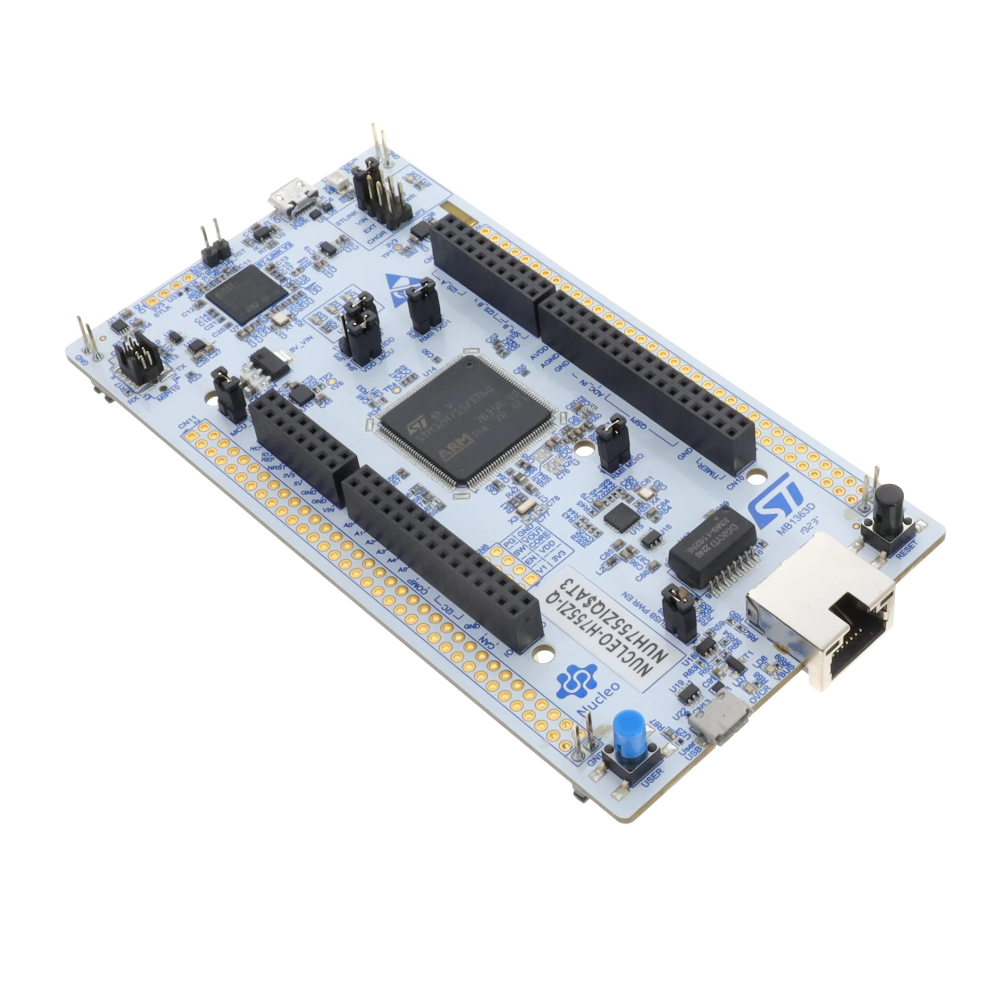
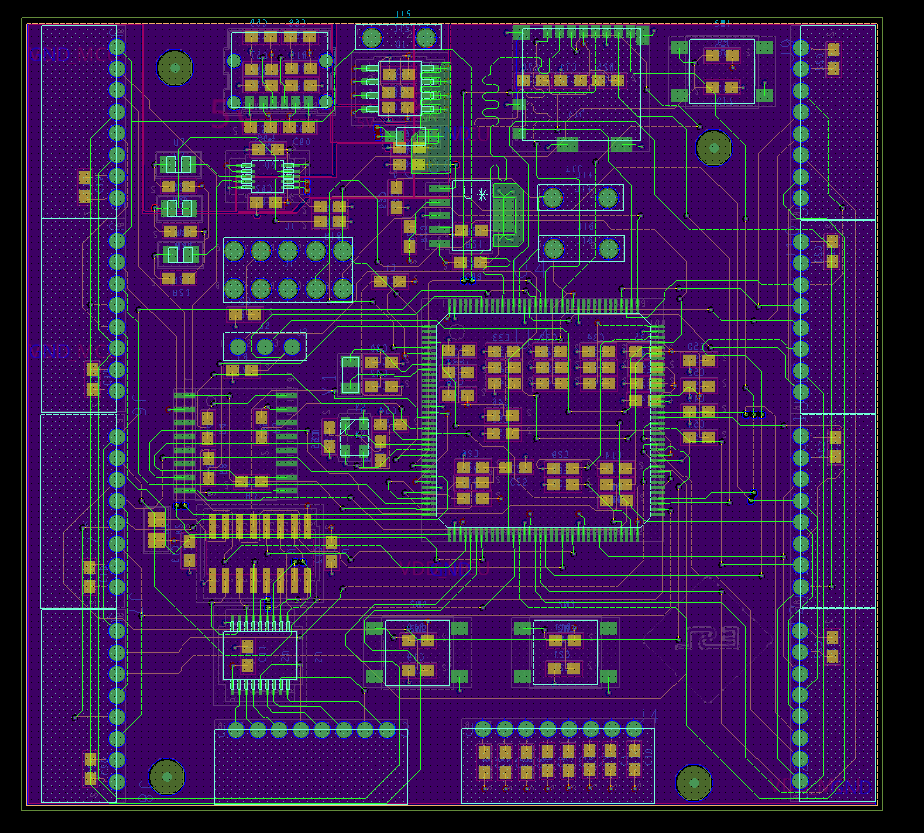

<h1 align="center">🦵 SPOT — Smart Posture Of Training</h1>

  Multi-IMU Squat Posture Classifier on STM32H7

  5 IMUs · STM32H755 (Dual-Core) · FreeRTOS · TCN · On-device AI · Custom PCB

  <!-- MCU / RTOS / AI / Sensors -->
  
  
  
  
   
  <!-- EDA / Tools -->
  
  
  
  

---

## 🧭 Overview

SPOT는 **5개의 IMU(가속도 + 자이로)**를 신체 주요 관절에 부착해 스쿼트 1회 동작을 시퀀스로 수집하고,  
**STM32H7 내부에서 TCN(Temporal Convolutional Network)으로 실시간 자세를 분류**하는 온디바이스 시스템입니다.

분류 대상은 다음 두 가지입니다.

- **정상 스쿼트**
- **무릎/허리 정렬이 무너진 비정상 스쿼트**

센서 동기화, 데이터 수집, 전처리, AI 추론까지  
**하나의 파이프라인을 보드 내부에서 완결**하는 것이 핵심 목표입니다.

---

## 🧵 System Pipeline

> Sensor → MCU Preprocess → On-device TCN → Logging / Feedback

1. **IMU 5개 동기 샘플링 (50 Hz)**
2. **프레임 버퍼링 + 스쿼트 1회 시퀀스 구성**
3. **Linear Resample (len → L=128 고정)**
4. **채널별 z-score 정규화**
5. **TCN 추론 (STM32Cube.AI)**
6. **Softmax 기반 클래스/신뢰도 출력 + UART 로깅**

---

## 🔩 Hardware

### Prototype Board (NUCLEO-H755ZI-Q)

  
  

- **MCU**: STM32H755 (Cortex-M7 + Cortex-M4 Dual-Core)
- **Clock**: up to 480 MHz (M7)
- **Interfaces**
  - **SPI**: IMU 5개 연결 (CS 개별 분리)
  - **FSYNC GPIO**: 50 Hz 센서 동기화
  - **UART + DMA**: PC 로깅/모니터링
  - **Debug GPIO**: 태스크/타이밍 토글 확인

---

### 📡 IMU Array

  

- **Sensors**: MPU-6500 / MPU-9250 계열 (6-axis)
- **Count**: 5 units
- **Sampling**: 50 Hz  
  - `SMPLRT_DIV`, DLPF 설정으로 내부 샘플레이트 고정
- **Typical setting**
  - Gyro FS: ±2000 dps  
  - Accel FS: ±8 g  
  - DLPF 적용으로 고주파 노이즈 억제

---

### Custom PCB (In Progress)

SPOT 전용 센서 허브 PCB를 직접 설계·제작하여  
착용/배선/동기화를 안정화하는 것이 최종 목표입니다.

  

---

## 🦾 Firmware (FreeRTOS)

SPOT 펌웨어는 목적에 따라 **두 개로 분리**되어 있습니다.

    firmware_logging/     # 데이터셋 수집 전용
    firmware_inference/   # 온디바이스 추론 전용

---

### 1) 🧵 Data Logging Firmware

**목적**: 모델 학습용 IMU 데이터셋 수집

- **Read_imu1 / Read_imu2 / Read_imu3**
  - 50 Hz 주기(SPI)
  - IMU1~5 RAW 읽기 + 스파이크 필터
  - 공유 프레임 갱신
- **vTaskLogger**
  - IMU 태스크 완료 신호 수신
  - 한 타임스텝을 **CSV 한 줄로 패킹**
  - UART DMA로 PC 스트리밍

**특징**  
- 안정적인 동기화 + 장시간 수집에 최적화된 데이터 로깅 펌웨어

---

### 2) 🧠 On-device Inference Firmware

**목적**: MCU 내부에서 **전처리 → TCN 추론 → 자세 클래스 출력**

- **Read_imu1 / Read_imu2 / Read_imu3**
  - 50 Hz로 IMU1~5 읽기/필터링
  - 완료 시 `imu_store`에 `xTaskNotify()`로 프레임 준비 알림
- **imu_store**
  - IMU 5개 프레임을 **순차 버퍼(imu_buffer)**에 누적
  - 스쿼트 1회 종료 시 `IMU_MODEL` 깨움
- **IMU_MODEL**
  - 시퀀스 **Linear Resample → L=128 고정**
  - 채널별 **z-score 정규화(μ/σ 저장값 사용)**
  - Cube.AI 변환 TCN 실행
  - Softmax 결과로 클래스/신뢰도 출력

**특징**  
- 스쿼트 “1회 동작 = 1시퀀스”로 처리하는 완전 온디바이스 구조  
- 외부 연산 없이 보드 내부에서 실시간 분류 파이프라인 완결

---

## 🏷️ Dataset & Labels

### CSV Schema

PC로 저장되는 데이터는 `.csv`이며 기본 컬럼 구조는 아래와 같습니다.

    Timestep
    IMU1_tick IMU1_ax IMU1_ay IMU1_az IMU1_gx IMU1_gy IMU1_gz
    IMU2_tick IMU2_ax IMU2_ay IMU2_az IMU2_gx IMU2_gy IMU2_gz
    IMU3_tick IMU3_ax IMU3_ay IMU3_az IMU3_gx IMU3_gy IMU3_gz
    IMU4_tick IMU4_ax IMU4_ay IMU4_az IMU4_gx IMU4_gy IMU4_gz
    IMU5_tick IMU5_ax IMU5_ay IMU5_az IMU5_gx IMU5_gy IMU5_gz
    move label person_id

    # Feature & Quaternion (per IMU)
    IMU1_a_mag IMU1_g_mag IMU1_pitch IMU1_roll IMU1_jerk_a_mag IMU1_yaw_int IMU1_qw IMU1_qx IMU1_qy IMU1_qz
    ...
    IMU5_a_mag IMU5_g_mag IMU5_pitch IMU5_roll IMU5_jerk_a_mag IMU5_yaw_int IMU5_qw IMU5_qx IMU5_qy IMU5_qz

    # Relative features
    REL_LH_pitch REL_LH_roll REL_RH_pitch REL_RH_roll
    REL_LK_pitch REL_LK_roll REL_RK_pitch REL_RK_roll
    REL_THIGH_yaw_diff REL_ANKLE_yaw_diff

- **move**: 스쿼트 1회 동작 단위(이벤트)
- **label**: 자세 클래스(정상/비정상)
- **person_id**: 피험자 구분  
- **feature/quat/relative**: 온디바이스 모델 입력 확장용 파생 특성

---

## 🧠 AI Model

- **Model**: TCN (Temporal Convolutional Network)
- **Input**: (L=128, C=90)  
  - 5 IMUs × 6 axes (ax, ay, az, gx, gy, gz)
- **Preprocess**
  - Linear resample to fixed length
  - Channel-wise z-score normalization
- **Deployment**
  - Python 학습 → HDF5 export
  - **STM32Cube.AI 변환 후 C inference 코드 통합**
  - Custom ops 없이 Cube.AI-safe 구성

---

## 🧪 Current Status

- 5-IMU 동기 샘플링(50 Hz) 안정화
- CSV 데이터셋 수집 파이프라인 구축
- Cube.AI-safe TCN 학습/변환/온디바이스 추론 완료
- 커스텀 PCB 리비전/착용 안정화 진행 중
- 실시간 피드백 UX 고도화 예정

---

## 🧵 Notes

- SPOT는 **센서 동기 타이밍, 버퍼링, 전처리까지 포함한 시스템 레벨 설계**에 초점을 둔 프로젝트입니다.
- 모델 성능 자체보다 **데이터 흐름의 안정성**과 **온디바이스 파이프라인 완결성**을 최우선으로 두고 있습니다.

---

MIT License
