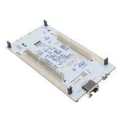
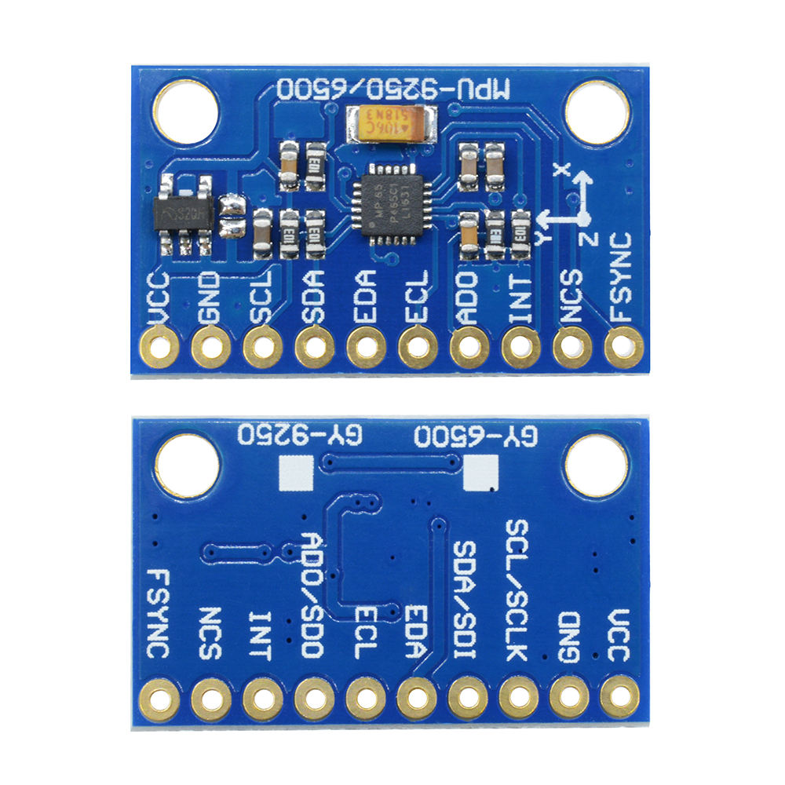
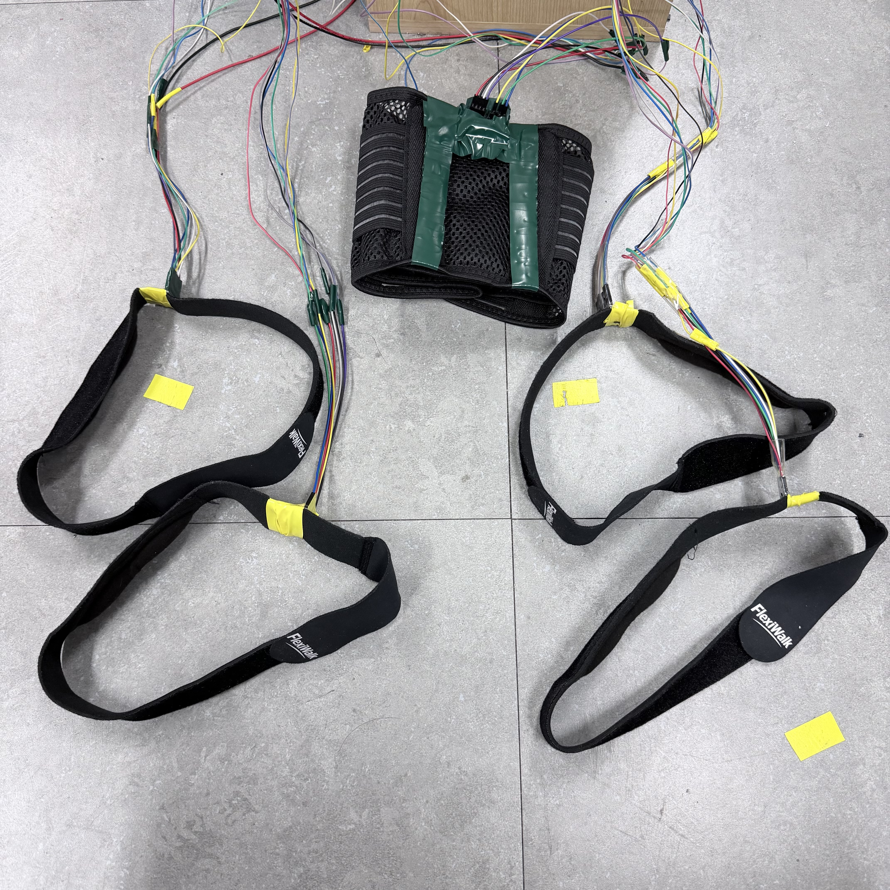

<h1 align="center">🏋️‍♀️SPOT -- Smart Posnal Of Traing</h1>

<p align="center">
  5 IMUs · STM32H7 · FreeRTOS · TCN · On-device AI · Custom PCB In Progress
</p>

<p align="center">
  
  
  
  
</p>

# 🏋️‍♀️ Multi-IMU Squat Posture Classifier  
> 5개의 IMU 센서 + STM32H7 + TCN 모델로 **스쿼트 자세를 실시간 분류**하는 임베디드 AI 프로젝트
> 
> 이 시스템만을 위한 **전용 커스텀 PCB를 직접 설계·제작**
---

## 📌 프로젝트 한줄 소개

몸에 부착한 **5개의 IMU(가속도계 + 자이로)**로 스쿼트 한 동작을 측정하고,  
STM32H7 보드 위에서 **TCN(Temporal Convolutional Network)** 모델로

- ✅ 올바른 스쿼트인지  
- ✅ 무릎/허리 등이 무너진 비정상 자세인지  

를 **실시간으로 분류**하는 시스템입니다.

---

## 🧩 시스템 개요

> 센서 → MCU(전처리 + AI) → PC 로깅까지 한 번에 도는 파이프라인

- 착용자: 허리, 허벅지(장경인대), 발목 주요 관절 부위에 **IMU 5개 부착**
- 센서: MPU-6500/9250 계열 IMU 5개
- MCU: **STM32H755** (Dual-Core, Cortex-M7/M4)
- RTOS: **FreeRTOS** 기반 멀티 태스크 구조
- 통신
  - IMU ↔ MCU: **SPI + FSYNC(50 Hz 동기화)**
  - MCU ↔ PC: **UART + DMA** 로 CSV 형태 로그 전송 (Traing을 위한 Data 수집)
- AI
  - Python에서 **TCN 모델 학습**
  - STM32Cube.AI로 MCU용 C 코드로 변환
  - 실시간으로 스쿼트 단위(window)를 분류

---

## 🛠 Hardware Spec

### MCU & 보드 & 장비
<p align="center">
  
  
</p>

- **STM32H755** (Cortex-M7 + Cortex-M4 듀얼 코어)
- 클럭: 최대 480 MHz (M7 기준)  
- 인터페이스 사용:
  - **SPI**: IMU 5개 연결 (각각 CS 핀 분리)
  - **UART**: PC로 로깅 (DMA 사용)
  - **GPIO**: FSYNC, CS, 디버깅용 핀(토글 파형 확인)

### IMU 센서
<p align="center">
  
</p>
- 센서: MPU-6500 / MPU-9250 계열 (가속도 + 자이로 6축)
- 개수: **5개**
- 샘플링 주기: **50 Hz** (SMPLRT_DIV 설정)
- 설정
  - 자이로 Full Scale: 예) ±2000 dps
  - 가속도 Full Scale: 예) ±8 g
  - DLPF(저역통과필터)를 통해 노이즈 감소
  
### 장비
<p align="center">
  
</p>
---

## ⚙️ Firmware / RTOS 구조

이 프로젝트의 펌웨어는 목적에 따라 **두 개의 FreeRTOS 프로젝트**로 구성되어 있습니다.

1. **Data Logging Firmware** — IMU 5개의 데이터를 50 Hz로 읽어서 CSV 형태로 로깅  
2. **On-device Inference Firmware** — 수집한 시퀀스를 이용해 TCN 모델로 자세를 분류

---

### 1️⃣ Data Logging Firmware (로깅 전용)

> IMU 원시 데이터를 **학습용 CSV 데이터셋**으로 만들기 위한 펌웨어

예시 태스크 생성 코드:

```c
xTaskCreate(vTaskLogger, "vTaskLogger", 1024, NULL, 3, NULL);
xTaskCreate(Read_imu1,   "Read_imu1",    512, NULL, 2, NULL);
xTaskCreate(Read_imu2,   "Read_imu2",    512, NULL, 2, NULL);
xTaskCreate(Read_imu3,   "Read_imu3",    512, NULL, 2, NULL);
---

## 📊 데이터 & 라벨 구조

### CSV 컬럼 구조

데이터는 PC에서 `.csv` 파일로 저장됩니다. 기본 스키마 예시는 다음과 같습니다:

```text
Timestep	IMU1_tick	IMU1_ax	IMU1_ay	IMU1_az	IMU1_gx	IMU1_gy	IMU1_gz	IMU2_tick	IMU2_ax	IMU2_ay	IMU2_az	IMU2_gx	IMU2_gy	IMU2_gz	IMU3_tick	IMU3_ax	IMU3_ay	IMU3_az	IMU3_gx	IMU3_gy	IMU3_gz	IMU4_tick	IMU4_ax	IMU4_ay	IMU4_az	IMU4_gx	IMU4_gy	IMU4_gz	IMU5_tick	IMU5_ax	IMU5_ay	IMU5_az	IMU5_gx	IMU5_gy	IMU5_gz	move	label	person_id	IMU1_a_mag	IMU1_g_mag	IMU1_pitch	IMU1_roll	IMU1_jerk_a_mag	IMU1_yaw_int	IMU1_qw	IMU1_qx	IMU1_qy	IMU1_qz	IMU2_a_mag	IMU2_g_mag	IMU2_pitch	IMU2_roll	IMU2_jerk_a_mag	IMU2_yaw_int	IMU2_qw	IMU2_qx	IMU2_qy	IMU2_qz	IMU3_a_mag	IMU3_g_mag	IMU3_pitch	IMU3_roll	IMU3_jerk_a_mag	IMU3_yaw_int	IMU3_qw	IMU3_qx	IMU3_qy	IMU3_qz	IMU4_a_mag	IMU4_g_mag	IMU4_pitch	IMU4_roll	IMU4_jerk_a_mag	IMU4_yaw_int	IMU4_qw	IMU4_qx	IMU4_qy	IMU4_qz	IMU5_a_mag	IMU5_g_mag	IMU5_pitch	IMU5_roll	IMU5_jerk_a_mag	IMU5_yaw_int	IMU5_qw	IMU5_qx	IMU5_qy	IMU5_qz	REL_LH_pitch	REL_LH_roll	REL_RH_pitch	REL_RH_roll	REL_LK_pitch	REL_LK_roll	REL_RK_pitch	REL_RK_roll	REL_THIGH_yaw_diff	REL_ANKLE_yaw_diff


